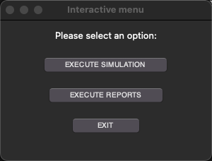
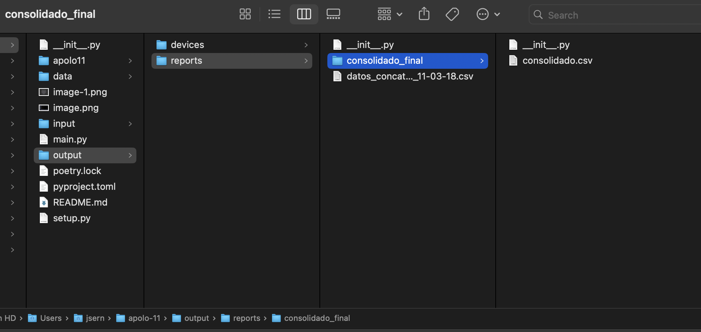

# Apolo-11: Python Bootcamp final project

Apolo-11 is a simulation project that generates data for NASA devices and generate reports based on the data generated. Project is built using Python and the Tkinter library to create a User Interface to have a better user experience.

## Table of Contents

- [Installation](##Installation)
- [Usage](##usage)
- [Examples](##Examples)

## Installation

In order to install Apolo-11 and all the dependencies, you can user this command:

```python
pip install apolo-11
```

## Usage

1. Configure "configuration.yaml" with your values

2. Go to "main.py" path and execute the file using the Terminal: [python] + [full path]/main.py

## Examples

1. Edit [Configuration file](input/configuration.yaml) file as desired:

```python
Missions:
  - ORBONE
  - CLNM
  - TMRS
  - GALAXONE
  - UNKN
DeviceType:
  - Satellite
  - Spacecraft
  - Spacesuit
  - Unknown
DeviceStatus:
  - excellent
  - good
  - warning
  - faulty
  - killed
  - unknown
```
There are three different ways to run the program
- When you want to have inifity loops, and you want the system to create files indefinitely:
```python
#--------------------------

#This part is shared among the three ways to run the program:
#range_for_files defines the quantity of files that will be generated during the execution
# If range_for_files is true, you need to use min_files_per_loop and max_files_per_loop to generate a random number between these two
# If range_for_files is false, you need to use only max_files_per_loop to generate a random number between 0 and max_files_per_loop
 
range_for_files: True
min_files_per_loop: 10 
max_files_per_loop: 20 
#--------------------------

# First way to run the program: When you want to have inifity loops, and you want the system to create files indefinitely (You can kill the program using Ctrl + C)
# execute_by_time must be FALSE

infinity_loops: True 

#--------------------------

num_loops: 2 
time_to_create_file: 1

#--------------------------
 
execute_by_time: False
time_execution_second: 5 
```

- When you want to execute the program for an specific time:
```python
#--------------------------

#This part is shared among the three ways to run the program:
#range_for_files defines the quantity of files that will be generated during the execution
# If range_for_files is true, you need to use min_files_per_loop and max_files_per_loop to generate a random number between these two
# If range_for_files is false, you need to use only max_files_per_loop to generate a random number between 0 and max_files_per_loop

range_for_files: True 
min_files_per_loop: 10 
max_files_per_loop: 20 

#--------------------------

infinity_loops: False 

#--------------------------

num_loops: 2 
time_to_create_file: 1

#--------------------------
#Second way to execute program: When you want to execute the program for an specific time:
# infinity_loops must be FALSE
# time_execution_second must be greater than 0
 
execute_by_time: True 
time_execution_second: 5
```

- When you want to run the program by a number of designated loops: 
  - if num_loops is 20, it will be creating one folder with 20 files
```python
#--------------------------

#This part is shared among the three ways to run the program:
#range_for_files defines the quantity of files that will be generated during the execution
# If range_for_files is TRUE, you need to use min_files_per_loop and max_files_per_loop to generate a random number between these two. 
# If range_for_files is FALSE, system will use 0 to max_files_per_loop: 20 to generate the number of files. 

range_for_files: True 
min_files_per_loop: 10 
max_files_per_loop: 20 

#--------------------------

infinity_loops: False 

#--------------------------

#Third way to run the program: When you want to run the program by a number of designated loops
# infinity_loops must be FALSE
# execute_by_time must be FALSE
# num_loop must be greater than 0

num_loops: 2 
time_to_create_file: 1 
#--------------------------

execute_by_time: False 
time_execution_second: 5 
```


2. Go to Terminal and execute "main.py"

```python
jsern@MHT7VD6W7N apolo-11 % /usr/local/bin/python3 /Users/jsern/apolo-11/main.py
```

3. Select "EXECUTE SIMULATION" and wait until simulation gets:

```python
INFO:root:Ending files creation
```



4. After simulation finish, you should be able to generate data for reporting using "EXECUTE REPORT":

```python
INFO:root:Starting reporting generation...
```

5. Once the reports are generated you will see:

```python
INFO:root:Reports executed.
```

6. User can click on exit and message displayed is:

```python
INFO:root:Aplication closed.
```

7. User will see all the data generated in "Reports" folder



## Test plan

In this section we will describe the different types of testing we will perform for the application in order to meet all the requirements specified on the project description file.

### Devices scope

- The program is built to be executed in any laptop using Windows, MacOS and Linux.
- This program is not attempt to be run on mobile devices.

### Testing scope

Testing will be divided in two main categories:

1. Functional testing: On this section we will perform the Boundaries technique to design and execute some test cases about the Inputs and Outputs NASA expects about the system.

2. Unit testing: We will perfom Unit test on the project with some paramaters as coverage around XX%.

### Funtional testing

- We will perform Boundaries technique to design test cases
- All the parameters mentioned below, are listed on the [Configuration file](input/configuration.yaml) where you can update it accordinly.

### Happy path's

| Scenario                                     | Cycle time (secs) | Encabezado 3 |
| -------------------------------------------- | ----------------- | ------------ |
| User changed cycle time to less than 20 secs | 5                 | Celda 1,3    |
| User changed cycle time upper than 20 secs   | 35                | Celda 3,3    |
| Celda 2,1                                    | 20                | Celda 2,3    |

### Unhappy path's
| Scenario                                     | Cycle time (secs) | Encabezado 3 |
| -------------------------------------------- | ----------------- | ------------ |
| User changed cycle time to less than 0 secs | 0                 | Celda 1,3    |